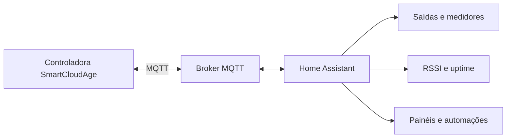

# SmartCloudAge para Home Assistant

[](https://github.com/felipengeletrica/hass-smartcloudage/actions/workflows/tests.yml)
[](https://hacs.xyz/)
[](https://www.home-assistant.io/)
[](https://github.com/felipengeletrica/hass-smartcloudage/releases)

Integração MQTT da **SmartCloudAge** para controle, medição e diagnóstico de controladoras no Home Assistant.

A integração cria entidades para as saídas da controladora, medidores acumulados de água, gás e energia elétrica, contadores genéricos e diagnósticos de sinal Wi-Fi e tempo de atividade. Todo o processamento ocorre pela integração MQTT oficial do Home Assistant.

## Recursos

- Controle de até 16 saídas por controladora.
- Leitura do estado atual das saídas via MQTT.
- Cadastro de medidores de pulsos nos canais 1 a 16.
- Medição acumulada de água e gás em `m³`.
- Medição acumulada de energia elétrica em `kWh`, compatível com o painel de Energia.
- Contadores genéricos com unidade configurável.
- Conversão do contador bruto por fator e offset.
- Sensores de diagnóstico de RSSI e uptime por controladora.
- Alarmes de sinal Wi-Fi ruim ou crítico nos logs.
- Registro da recuperação do sinal sem repetição excessiva.
- Detecção de possível reinicialização pela queda do uptime.
- Sincronização automática do relógio da controladora a cada 5 minutos.
- Configuração pela interface do Home Assistant.
- Traduções em português do Brasil e inglês.
- Testes automatizados com `pytest` e GitHub Actions.

Além da integração residencial e predial, a tecnologia SmartCloudAge foi aplicada a conceitos de ambientes sencientes: automação por presença, iluminação, climatização, controle de acesso, painéis informativos e modos de economia de energia.

## Arquitetura



## Requisitos

- Home Assistant `2025.8.3` ou mais recente.
- Broker MQTT acessível pelo Home Assistant.
- Integração MQTT oficial configurada e funcionando.
- HACS para a instalação recomendada.
- Controladora SmartCloudAge publicando no tópico MQTT configurado.

## Instalação pelo HACS

1. Abra **HACS → Integrações**.
2. No menu, selecione **Repositórios personalizados**.
3. Informe:

   ```text
   https://github.com/felipengeletrica/hass-smartcloudage
   ```

4. Selecione a categoria **Integração** e adicione o repositório.
5. Procure por **SmartCloudAge MQTT** e instale.
6. Reinicie o Home Assistant.
7. Acesse **Configurações → Dispositivos e serviços → Adicionar integração**.
8. Procure por **SmartCloudAge**.

## Instalação manual

Copie a pasta:

```text
custom_components/smartcloudage
```

para:

```text
<configuração_home_assistant>/custom_components/smartcloudage
```

Reinicie o Home Assistant e adicione a integração pela interface.

## Configuração da controladora

Ao adicionar a integração, preencha:

| Campo | Descrição |
|---|---|
| ID do dispositivo | Identificador usado pela controladora no MQTT, por exemplo `controller-01` |
| Quantidade de saídas | Número de saídas criadas no Home Assistant, de 0 a 16 |
| Nome do dispositivo | Nome amigável exibido na interface |
| Configurar medidor | Abre o cadastro de medidores de pulsos |

Use um ID estável e exatamente igual ao informado pela controladora. O comando de saída é publicado em:

```text
CloudAge/<device_id>
```

Os estados e dados de telemetria são recebidos em:

```text
CloudAge/<device_id>/OutTopic/#
```

## Medidores de pulsos

É possível cadastrar vários medidores por controladora, com um medidor por canal.

| Campo | Descrição |
|---|---|
| Canal | Entrada física do contador, entre 1 e 16 |
| Nome | Nome da entidade, por exemplo `Apartamento 201` |
| Tipo | Água, gás, energia elétrica ou contador genérico |
| Fator | Quantidade representada por cada pulso |
| Offset | Valor acumulado anterior à instalação |
| Unidade | Usada pelo contador genérico; água, gás e energia usam unidades nativas |

O valor acumulado é calculado por:

```text
pulsos = (MSB × 65536) + LSB
total  = (pulsos × fator) + offset
```

Exemplo:

```text
MSB = 0
LSB = 208
fator = 0,01
offset = 5,502

total = (208 × 0,01) + 5,502 = 7,582 m³
```

### Tipos e unidades

| Tipo | Classe no Home Assistant | Unidade | Classe de estado |
|---|---|---|---|
| Água | `water` | `m³` | `total_increasing` |
| Gás | `gas` | `m³` | `total_increasing` |
| Energia elétrica | `energy` | `kWh` | `total_increasing` |
| Contador genérico | Sem classe fixa | Configurável | `total_increasing` |

Para garantir estatísticas válidas, a integração força `m³` para água e gás e `kWh` para energia, mesmo que outra unidade tenha sido informada anteriormente.

## Painel de Energia

Depois de cadastrar um medidor como **Energia elétrica**:

1. Reinicie ou recarregue a integração.
2. Aguarde uma nova leitura MQTT válida.
3. Confirme que a entidade possui estado numérico em `kWh`.
4. Acesse **Configurações → Painéis → Energia**.
5. Adicione a entidade em **Dispositivos individuais**.

O Home Assistant pode levar algum tempo para criar a primeira estatística. Caso a entidade não apareça, consulte **Ferramentas do desenvolvedor → Estatísticas**.

## Diagnósticos de comunicação

Cada controladora possui duas entidades de diagnóstico:

- **Sinal Wi-Fi**: intensidade em `dBm`.
- **Uptime**: tempo de atividade informado pela controladora, armazenado em segundos e apresentado pelo Home Assistant como duração.

A leitura de RSSI aceita os campos:

```text
Wifi_db, wifi_db, RSSI ou rssi
```

A leitura de uptime aceita:

```text
uptime, Uptime ou UPTIME
```

### Classificação do sinal

| RSSI | Classificação | Alarme |
|---:|---|---|
| Maior que `-67 dBm` | Bom (`good`) | Não |
| De `-67` até acima de `-75 dBm` | Regular (`fair`) | Não |
| De `-75` até acima de `-85 dBm` | Ruim (`poor`) | Sim, aviso |
| Menor ou igual a `-85 dBm` | Crítico (`critical`) | Sim, erro |

Os atributos do sensor incluem:

```yaml
signal_quality: poor
alarm: true
warning_threshold_dbm: -75
critical_threshold_dbm: -85
```

O log é emitido somente quando a classificação muda. Quando o sinal volta a uma faixa sem alarme, a recuperação também é registrada.

Se o uptime atual for menor que o anterior, a integração registra uma possível reinicialização da controladora.

Para acompanhar os eventos:

```bash
docker compose logs -f homeassistant \
  | grep -Ei "smartcloudage|wifi|rssi|uptime|restarted"
```

## Exemplo de payload

```json
{
  "message": "PULSE_SENSOR",
  "device": "controller-01",
  "Wifi_db": -72,
  "uptime": 3121,
  "Pulses": [
    {
      "Sensor": 9,
      "lsb": 208,
      "msb": 0
    }
  ]
}
```

Os diagnósticos podem ser atualizados mesmo quando a mensagem não for do tipo `PULSE_SENSOR`, desde que o payload contenha o ID da controladora e os campos de RSSI ou uptime.

## Controle de saídas

Para cada saída configurada, a integração cria uma entidade `switch`. O comando MQTT segue este formato:

```json
{
  "command": 11,
  "type": 1,
  "signature": "controller-01",
  "payload": {
    "id": 1,
    "value": 1
  }
}
```

Onde:

- `id` identifica a saída, começando em 1;
- `value: 1` liga a saída;
- `value: 0` desliga a saída.

## Exemplo de painel

```yaml
type: grid
columns: 2
square: false
cards:
  - type: tile
    entity: switch.controller_01_output_1
    name: Iluminação
  - type: tile
    entity: sensor.controller_01_sinal_wi_fi
    name: Sinal Wi-Fi
  - type: tile
    entity: sensor.controller_01_uptime
    name: Tempo ligado
  - type: tile
    entity: sensor.apartamento_201
    name: Consumo acumulado
```

Os IDs reais das entidades dependem do alias e dos nomes informados no cadastro. Confirme-os em **Configurações → Dispositivos e serviços → Entidades**.

## Atualização local

Para atualizar o repositório local:

```bash
git switch main
git pull --ff-only origin main
```

Se houver alterações locais:

```bash
git status
git stash push -u -m "alterações locais antes da atualização"
git pull --ff-only origin main
git stash pop
```

Depois, reinicie o Home Assistant:

```bash
docker compose restart homeassistant
```

## Desenvolvimento e testes

Crie um ambiente virtual e instale as dependências:

```bash
python3 -m venv .venv
source .venv/bin/activate
python -m pip install --upgrade pip
python -m pip install -r requirements_test.txt
```

Execute a suíte:

```bash
pytest -v --cov=custom_components.smartcloudage --cov-report=term-missing
```

Os testes cobrem:

- fluxo de configuração;
- validação de fator e canais duplicados;
- cálculo por pulsos, fator e offset;
- reconstrução do contador de 32 bits;
- classes e unidades de água, gás e energia;
- identidade de dispositivos e entidades;
- sincronização RTC;
- classificação e transições de RSSI;
- recuperação do sinal;
- detecção de reinicialização por uptime.

O workflow em `.github/workflows/tests.yml` executa os testes automaticamente em pushes para `main` e em pull requests.

## Solução de problemas

### A integração não aparece

- Confirme que a pasta está em `custom_components/smartcloudage`.
- Verifique se o `manifest.json` está dentro dessa pasta.
- Reinicie o Home Assistant.
- Consulte os logs por erros de carregamento.

### As entidades estão indisponíveis

- Confirme que a integração MQTT está conectada.
- Verifique se o `device_id` corresponde ao usado no tópico.
- Aguarde uma nova publicação da controladora.
- Inspecione os tópicos com uma ferramenta MQTT.

### O medidor não atualiza

- Confirme que `message` é `PULSE_SENSOR`.
- Verifique se `Pulses` contém o canal cadastrado.
- Confira se `lsb` e `msb` são numéricos.
- Certifique-se de que o fator é maior que zero.

### O sensor de RSSI ou uptime não aparece

- Atualize para a versão `1.2.0` ou mais recente.
- Recarregue a integração.
- Aguarde um payload com um dos nomes de campo aceitos.
- Abra o dispositivo e habilite a visualização das entidades de diagnóstico.

### O painel de Energia não aceita o sensor

- Confirme que o medidor foi cadastrado como **Energia elétrica**.
- Verifique se a unidade é `kWh`.
- Confirme `device_class: energy` e `state_class: total_increasing`.
- Consulte os erros em **Ferramentas do desenvolvedor → Estatísticas**.

## Segurança

- Não exponha o broker MQTT diretamente à internet.
- Utilize autenticação e restrinja os tópicos por usuário.
- Mantenha Home Assistant, broker, integração e firmware atualizados.
- Use uma rede local ou VPN para acesso remoto.
- Não publique credenciais, endereços internos ou payloads sensíveis em issues.

## Estrutura do projeto

```text
hass-smartcloudage/
├── .github/workflows/tests.yml
├── custom_components/smartcloudage/
│   ├── __init__.py
│   ├── config_flow.py
│   ├── manifest.json
│   ├── sensor.py
│   ├── switch.py
│   ├── strings.json
│   └── translations/
├── tests/
├── hacs.json
├── pyproject.toml
└── requirements_test.txt
```

## Suporte e contato

- Site: [smartcloudage.net.br](https://smartcloudage.net.br/)
- Issues: [GitHub Issues](https://github.com/felipengeletrica/hass-smartcloudage/issues)

## Licença

Consulte os arquivos do repositório para verificar os termos de licença aplicáveis antes de redistribuir ou incorporar o código em outros projetos.
